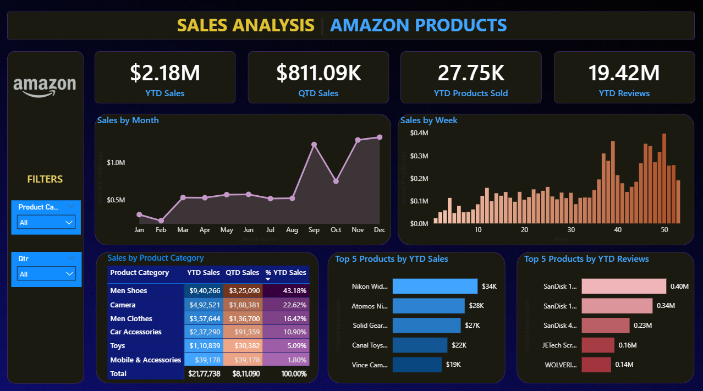

# 📦 Amazon Sales Analysis Dashboard (Power BI)

## 📌 Problem Statement  
The goal of this project was to analyze **Amazon sales performance** using an interactive Power BI dashboard.  
The dashboard provides stakeholders with insights into revenue trends, product performance, and customer feedback, enabling better data-driven decision-making.  

---

## 🎯 KPI Requirements  
- **YTD Sales** → Monitor year-to-date sales to gauge overall revenue performance.  
- **QTD Sales** → Track quarterly sales figures to identify sales trends and fluctuations.  
- **YTD Products Sold** → Analyze the total number of products sold throughout the year to understand movement.  
- **YTD Reviews** → Keep tabs on year-to-date product reviews to assess customer satisfaction.  

---

## 📊 Charts & Visualizations  
- **Sales by Month (Line Chart)** → Identify seasonal patterns and long-term growth trends.  
- **Sales by Week (Column Chart)** → Pinpoint short-term fluctuations in sales.  
- **Sales by Product Category (Heat Map/Text)** → Overview of sales distribution across categories.  
- **Top 5 Products by YTD Sales (Bar Chart)** → Highlight best-selling products generating the most revenue.  
- **Top 5 Products by YTD Reviews (Bar Chart)** → Identify most-reviewed products to understand customer preferences.  

---

## 🖼️ Dashboard Preview  
  

---

## 🚀 Key Insights  
- Clear visibility of **sales seasonality** and peak demand periods.  
- Product categories with highest contribution to **overall revenue**.  
- Correlation between **sales volume** and **customer reviews**.  
- Top-performing products that drive the majority of sales. 
